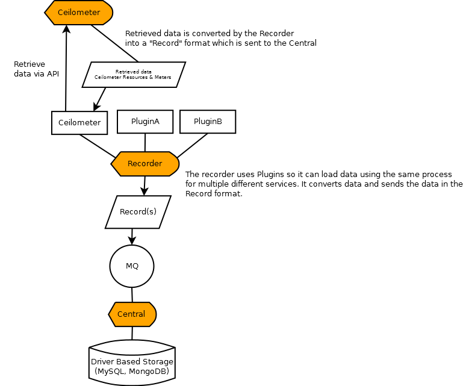
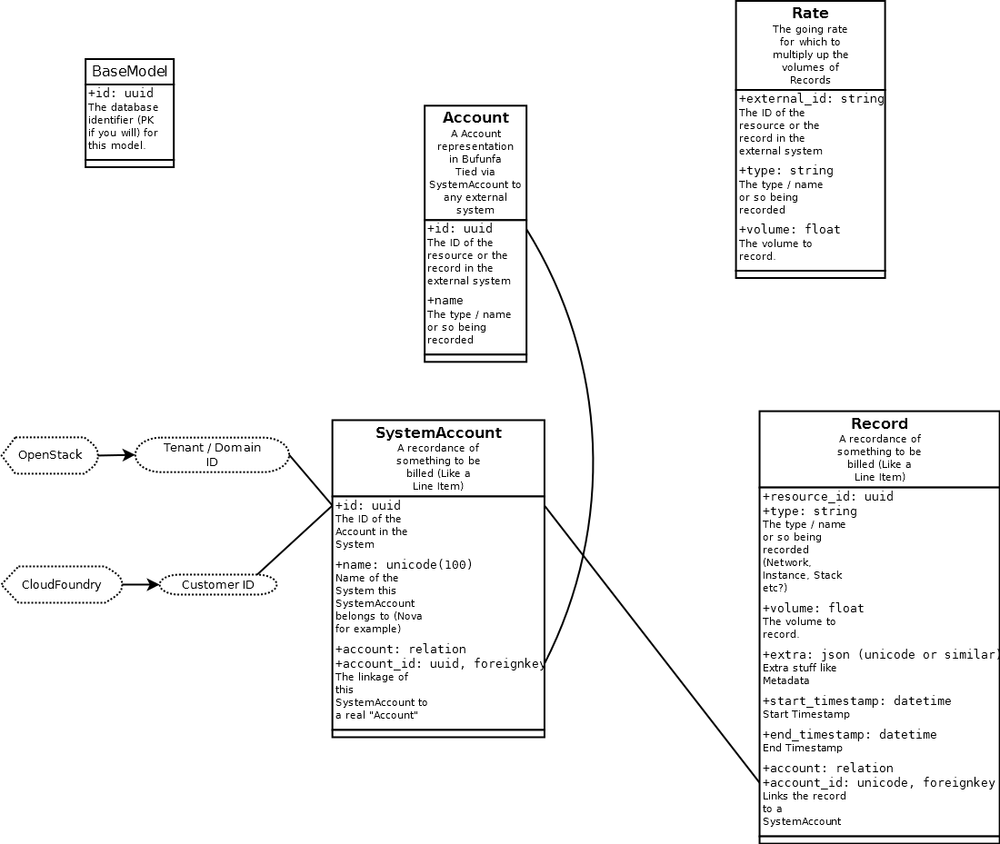

..
    Copyright 2012 Endre Karlson for Bouvet ASA

    Licensed under the Apache License, Version 2.0 (the "License"); you may
    not use this file except in compliance with the License. You may obtain
    a copy of the License at

        http://www.apache.org/licenses/LICENSE-2.0

    Unless required by applicable law or agreed to in writing, software
    distributed under the License is distributed on an "AS IS" BASIS, WITHOUT
    WARRANTIES OR CONDITIONS OF ANY KIND, either express or implied. See the
    License for the specific language governing permissions and limitations
    under the License.

.. _architecture:

============
Architecture
============

.. index::
    double: architecture; brief

Brief overview
++++++++++++++
    :term:`central` is the central component that stores data persistantly in
    :term:`storage` which is a backend using typically SQLAlchemy, MongoDB or
    others.

    :term:`recorder` is the component that will fetch records from external
    datasources. This can look a bit like Ceilometer's agents but it's not
    quite. It loads difference "plugins" which it uses to poll data and
    transforms the data into a :term:`record`.

    :term:`api` standard OpenStack alike REST api service that communicates via
    :term:`mq` to :term:`central` in order to do actions like adding
    records and so on.

Service layout
++++++++++++++
Below you can see a picture of how Bufunfa's services work.

Storage layout
++++++++++++++
Below you can see a picture of how Bufunfa's storage is layed out.

